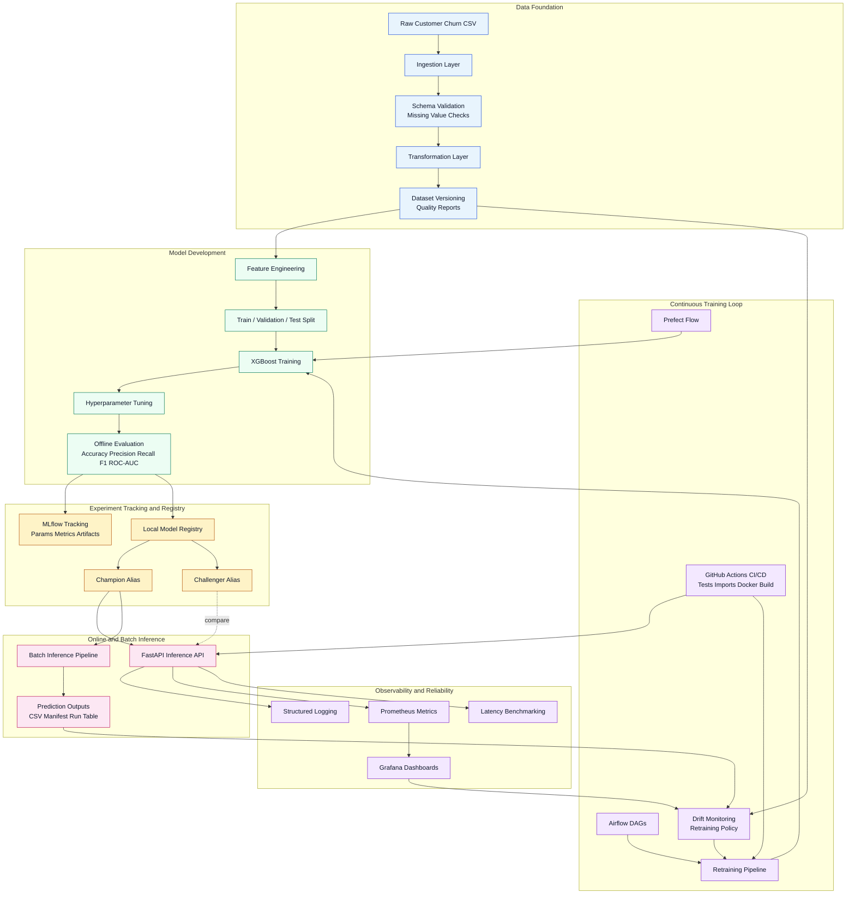

# MLOps Pipeline Platform

A production-style open-source MLOps platform for tabular customer churn prediction.

This repository is built to demonstrate how a senior ML engineer or MLOps architect designs the full lifecycle around a model, not just the model itself. It covers data contracts, dataset lineage, feature processing, experiment tracking, model versioning, champion-challenger promotion, inference serving, observability, retraining policy design, and deployment-ready workflows.

It is intentionally opinionated and platform-shaped. The codebase is organized to look like something a real engineering team could extend, review, and operate.

## Why This Repository Exists

Most portfolio projects stop at training a classifier. Real MLOps systems do not. They need to answer questions like these:

- How is the dataset validated before training starts?
- How are feature transformations kept consistent between training and inference?
- How is every experiment, artifact, and model candidate traced?
- How do you compare a challenger against the current champion without hand-waving?
- How do you expose model metadata, health, and latency in production?
- How do you think about retraining triggers, rollback, and deployment readiness?

This repository is meant to make those answers visible in code.

## Platform Highlights

- End-to-end training pipeline for a realistic churn prediction use case.
- Schema validation, missing-value checks, dataset fingerprinting, and data quality reports.
- Feature engineering with a reusable preprocessing contract.
- XGBoost training, hyperparameter tuning, and offline evaluation.
- MLflow-backed experiment tracking for parameters, metrics, models, and artifacts.
- Lightweight local model registry with version numbers, champion alias, challenger alias, and rollback semantics.
- FastAPI inference service with typed request and response models.
- Prometheus metrics, Grafana dashboard assets, structured logs, and latency benchmarking.
- Airflow and Prefect orchestration examples for scheduled and code-first workflows.
- Dockerized local stack plus GitHub Actions CI/CD workflows.

## Business Use Case

Customer churn prediction is a high-value operational use case in telecom, SaaS, subscription businesses, and financial services. Teams use churn predictions to prioritize retention campaigns, reduce revenue leakage, and target the customers most at risk before contract or renewal events.

This platform trains a binary classifier that predicts churn based on customer tenure, contract structure, billing preferences, support coverage, service configuration, and pricing signals.

## What Makes This Production-Oriented

- Separation of concerns across data, features, training, evaluation, registry, serving, monitoring, and orchestration.
- Explicit lifecycle thinking through dataset versions, model versions, aliases, and retraining decisions.
- Strong operational surfaces such as `/health`, `/metrics`, structured logs, health checks, and batch audit outputs.
- Local-first reproducibility without pretending the system is only a local demo.
- Design choices that open the door to realistic interview discussions about governance, release strategy, and platform evolution.

## Architecture Overview



## Quick Start

### 1. Install dependencies

```bash
python -m venv .venv
source .venv/bin/activate  # Linux/macOS
.venv\Scripts\activate     # Windows PowerShell
pip install -r requirements.txt
```

### 2. Train a model

```bash
make train
```

### 3. Start the inference API

```bash
make run
```

### 4. Run the local platform stack

```bash
make docker-up
```

This brings up the API, MLflow, Prometheus, and Grafana with health checks configured in Compose.

## End-to-End Lifecycle

### Data ingestion and validation

The platform ingests a raw churn dataset from `data/raw/customer_churn.csv`, validates required schema and missing-value ratios, checks duplicate identifiers, and produces a structured validation report.

### Transformation and feature engineering

The raw tabular dataset is normalized into a training-ready form, then passed through a reusable preprocessing graph that handles numeric and categorical features consistently across training and inference.

### Dataset versioning and quality reporting

Each transformed dataset receives a lightweight fingerprint-based version identifier. The platform also persists a data quality report summarizing missingness, duplicates, numerical statistics, and dominant categorical values.

### Training and hyperparameter tuning

The training pipeline uses XGBoost inside a scikit-learn pipeline. Hyperparameter tuning uses randomized search to improve candidate quality while keeping iteration time practical.

### Evaluation and release gates

The evaluation layer computes classification metrics suitable for churn modeling:

- accuracy
- precision
- recall
- F1-score
- ROC-AUC

The model is then checked against performance thresholds before it enters the registry.

### Experiment tracking and artifacts

Each training run logs parameters, metrics, artifacts, dataset metadata, and the trained model to MLflow. This provides a reproducible audit trail for every candidate.

### Model registry and serving aliases

The repository includes a lightweight local registry backed by `models/registry/registry.json`. It tracks:

- version label
- version number
- stage
- serving alias
- dataset version
- dataset fingerprint
- MLflow run ID
- metrics and validation issues

The first deployable model becomes the champion. Subsequent acceptable candidates become challengers until explicitly promoted.

### Online and batch inference

The FastAPI service serves the champion model by default and can optionally route scoring against the challenger alias for controlled comparison. Batch inference generates prediction outputs plus an audit manifest and append-only run table.

### Monitoring and continuous improvement

Prometheus metrics, Grafana dashboards, structured logs, and a retraining policy placeholder create a realistic backbone for operations, drift review, and retraining discussions.

## Model Promotion Strategy

This repository deliberately models release behavior using champion and challenger aliases instead of automatic model replacement.

- Champion: the model currently intended for production serving.
- Challenger: the latest candidate being evaluated against the champion.
- Promotion: an explicit registry action that reassigns the champion alias.
- Rollback: a metadata-level reassignment back to a known-good version.

This is closer to how mature ML platforms reduce risk than naive overwrite-style deployment.

## Configuration Model

The platform supports both YAML-based and environment-based configuration.

- Base defaults live in `config/platform.yaml`.
- Environment variables with the `MLOPS_` prefix override those defaults.
- Filesystem paths are normalized centrally so scripts, tests, and services behave consistently.

Copy `.env.example` to `.env` when you want a local override file.

## Local Development Workflows

### Train

```bash
make train
```

For faster local iteration:

```bash
python scripts/run_training.py --skip-tuning
```

### Evaluate

```bash
make evaluate
```

### Batch inference

```bash
python scripts/run_batch_inference.py --input-path data/raw/customer_churn.csv --output-path data/processed/batch_predictions.csv
```

Each batch run produces:

- a prediction output file
- a JSON manifest with model and dataset metadata
- an append-only CSV run table

### Benchmark inference latency

```bash
make benchmark
```

## API Usage

### Health endpoint

```bash
curl http://localhost:8000/health
```

### Prediction request

```bash
curl -X POST http://localhost:8000/api/v1/predict \
  -H "Content-Type: application/json" \
  -d '{
    "records": [
      {
        "customer_id": "CUST-9001",
        "gender": "Female",
        "senior_citizen": 0,
        "partner": "Yes",
        "dependents": "No",
        "tenure": 12,
        "phone_service": "Yes",
        "multiple_lines": "No",
        "internet_service": "Fiber optic",
        "online_security": "No",
        "online_backup": "Yes",
        "device_protection": "Yes",
        "tech_support": "No",
        "streaming_tv": "Yes",
        "streaming_movies": "Yes",
        "contract": "Month-to-month",
        "paperless_billing": "Yes",
        "payment_method": "Electronic check",
        "monthly_charges": 92.4,
        "total_charges": 1108.8
      }
    ]
  }'
```

### Example response

```json
{
  "model_version": "customer-churn-classifier-v0001",
  "version_number": 1,
  "model_alias": "champion",
  "dataset_version": "customer-churn-dataset-20260312T010101Z-ab12cd34ef56",
  "predictions": [
    {
      "customer_id": "CUST-9001",
      "churn_probability": 0.8123,
      "predicted_churn": "Yes"
    }
  ]
}
```

### Metrics endpoint

```bash
curl http://localhost:8000/metrics
```

## Observability

Observability is treated as part of the product surface, not as optional infrastructure.

- JSON structured logs across training and inference.
- Prometheus metrics for request count, latency, predictions, model metadata, and errors.
- Grafana dashboard assets for local inspection and portfolio demonstration.
- Service health checks in Docker Compose.
- Latency benchmark output for inference performance discussions.

## Orchestration

The repository shows two orchestration styles because real teams vary in platform preference.

- Airflow DAGs for scheduled training and retraining.
- Prefect flow for a Python-native orchestration pattern.

This lets the project demonstrate scheduler-oriented and code-first operational models without forcing one tool as the only answer.

## Retraining and Drift Design

The drift and retraining modules are intentionally realistic but lightweight.

The current retraining decision combines:

- drift placeholder results
- dataset version comparison
- data quality summary
- manual override support

In a production system, this layer would expand to include online performance degradation, business KPI movement, feature freshness, schema events, and label availability windows.

That placeholder is deliberate: the project is stronger when it shows a design boundary clearly rather than pretending every enterprise capability is fully implemented locally.

## Reproducibility

This repository is structured to make reruns and audits straightforward.

- Global seed control is centralized.
- Settings are versionable and environment-aware.
- Processed datasets, feature manifests, data quality reports, benchmarks, and model artifacts are written to deterministic locations.
- MLflow captures experiments and artifacts for each training run.
- Docker provides a consistent local runtime for the core platform services.

## CI/CD

The GitHub Actions setup reflects a practical engineering workflow.

- A test job installs dependencies, validates imports, and runs the pytest suite.
- A downstream Docker job validates image buildability separately.
- A deploy workflow builds and publishes the API image to GitHub Container Registry.

This is a better production story than a single all-in-one workflow because it separates quality gates from packaging concerns.

## Deployment Readiness

The repository is local-first, but not local-only.

- The API is containerized.
- MLflow is containerized.
- Monitoring assets are included.
- Health checks are configured.
- Cloud deployment guidance is documented.
- Promotion and rollback are modeled as registry operations rather than retraining events.

See `infrastructure/deployment/deployment_guide.md` for cloud topology options, deployment patterns, and rollback guidance.

## Repository Layout

```text
mlops-pipeline-platform/
├── app/                    # FastAPI app, inference runtime, monitoring
├── src/                    # Data, features, training, evaluation, registry
├── pipelines/              # Training, batch inference, retraining entrypoints
├── orchestration/          # Airflow DAGs and Prefect flows
├── mlops/                  # MLflow integration, drift, monitoring assets
├── scripts/                # Operational CLI entrypoints
├── tests/                  # Automated verification
├── data/                   # Raw and processed datasets
├── models/                 # Exported models and local registry state
├── notebooks/              # Exploratory analysis
├── infrastructure/         # Docker and deployment guidance
├── .github/workflows/      # CI/CD automation
├── docker-compose.yml
├── requirements.txt
├── .env.example
├── Makefile
└── README.md
```

## Local Platform Endpoints

When the stack is running via Docker Compose:

- API: `http://localhost:8000`
- MLflow: `http://localhost:5000`
- Prometheus: `http://localhost:9090`
- Grafana: `http://localhost:3000`

## Make Targets

- `make train`
- `make evaluate`
- `make run`
- `make test`
- `make mlflow`
- `make docker-up`
- `make benchmark`

## Future Improvements

- Replace the local JSON registry with a managed model registry.
- Store artifacts in object storage rather than the local filesystem.
- Add feature store integration and stricter offline-online parity checks.
- Add canary deployment and shadow inference workflows.
- Introduce richer drift alerting and retraining approvals.
- Add authentication, rate limiting, and audit controls to the API.

## Why This Reads Well in Senior Interviews

This project creates room for the right conversations.

It demonstrates implementation skill, but more importantly it demonstrates systems thinking: how models are validated, versioned, served, compared, monitored, promoted, and rolled back inside an engineering platform.

That is the difference between a machine learning demo and an MLOps project.
